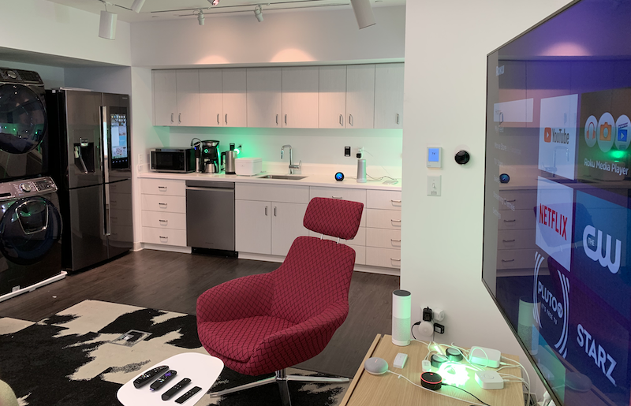

# Information Exposure From Consumer IoT Devices

This site contains analysis code accompanying the paper "Information Exposure From Consumer IoT Devices: A Multidimensional, Network-Informed Measurement Approach", in proceedings of the ACM Internet Measurement Conference 2019 (IMC 2019), October 2019, Amsterdam, Netherlands. 

The official paper page can be found at https://moniotrlab.ccis.neu.edu/imc19/. The page contains instructions for requesting access to the full dataset.

The testbed code and documentation can be found at https://moniotrlab.ccis.neu.edu/tools/. Currently it is deployed at both Northeastern University and Imperial College London. 



## File Structure 
Each subfolder shows samples of processing each PCAP file for destination, encryption, and content analysis.

- `README.md` - This file
- `moniotr/` - Code to automate experiments  
- `destinations/` - Code for Section 4. Destination Analysis   
- `encryption/` - Code for Section 5. Encryption Analysis   
- `model/` - Code for Section 6. Content Analysis   

## Datasets
We release the traffic (packet headers) from 34,586 controlled experiments and 112 hours of idle IoT traffic.

The naming convention for the data is `{country}{-vpn}/{device_name}/{activity_name}/{datetime}.{length}.pcap`. For example, `us/amcrest-cam-wired/power/2019-04-10_21:32:18.256s.pcap` is the traffic collected from device `amcrest-cam-wired` when `power` on at the time of 2019-04-10_21:32:18, which lasts `256` seconds in the `us` lab without VPN.

To obtain access to the dataset please follow the instructions on the paper webpage at https://moniotrlab.ccis.neu.edu/imc19. We require that you agree to the terms of our data sharing agreement. 
This is out of an abundance of caution to protect any private or security-sensitive information that we were unable to remove from the traces.

## Setup
This version relies on version Python 3.6 (tested on Python 3.6.3).

It is strongly suggested that one uses the following virtual environment:
```
sudo apt-get install virtualenv
sudo apt-get install libpcap-dev libpq-dev
sudo apt-get install python3-dev
sudo apt-get install python3.6-tk
sudo apt-get install gcc

virtualenv -p python3.6 env3
source env3/bin/activate
```

Once the environment is setup and running, install the following packages:
````
pip install numpy
pip install scipy
pip install pyshark
pip install geoip2
pip install matplotlib
pip install dpkt
pip install pycrypto
pip install IPy
pip install pcapy
pip install scapy
pip install Impacket
pip install mysql-connector-python-rf
pip install pandas
pip install tldextract
pip install python-whois
pip install ipwhois
pip install psutil
````

